# Adams Family Reunion — Past Reunion Statistics

A look back at over 60 years of family reunion history, spanning 21 gatherings from 1962 to 2025. The family has met across 13 states and 5 regions, favoring resorts and state parks in the West and Midwest.

---

## Reunion History

The table below lists every reunion on record, including location, venue type, nearest airports, July climate normals, and travel distances.

| Year | Location | State | Region | Venue Type | Nearest Major Airport | Major Dist (km) | Nearest Regional Airport | Regional Dist (km) | Avg High °F | Avg Low °F | Avg Humidity % |
|------|----------|-------|--------|------------|-----------------------|-----------------|--------------------------|---------------------|-------------|------------|----------------|
| 1962 | Blue Bell Lodge | SD | Midwest | Lodge | DEN (Denver Intl) | 426.9 | K3V0 (Custer State Park Airport) | 16.8 | 79.4 | 55.2 | 45.6 |
| 1966 | Eagle Bay Resort | MN | Midwest | Resort | MSP (Minneapolis-St. Paul) | 264.0 | Y49 (Walker Municipal Airport) | 11.7 | 77.9 | 58.0 | 55.6 |
| 1970 | Clement Beach Cottages | IA | Midwest | Cottages | MSP (Minneapolis-St. Paul) | 234.2 | 4D8 (Fuller Airport) | 3.8 | 84.3 | 62.6 | 53.0 |
| 1973 | Shore Acres Resort, Table Rock | MO | Midwest | Resort | DFW (Dallas/Fort Worth Intl) | 532.6 | KPLK (M. Graham Clark Downtown Airport) | 9.7 | 89.1 | 70.3 | 73.4 |
| 1976 | Red 11 Point | OK | South | Resort | DFW (Dallas/Fort Worth Intl) | 463.8 | KGMJ (Grove Municipal Airport) | 7.3 | 91.6 | 71.5 | 63.4 |
| 1979 | The Moors | KY | South | Resort | ATL (Atlanta Hartsfield-Jackson) | 489.8 | 42KY (Pirates Cove Airport) | 17.2 | 88.2 | 70.9 | 79.4 |
| 1982 | Harmel's Ranch Resort | CO | West | Ranch Resort | DEN (Denver Intl) | 310.7 | 3CO0 (Sky Island Ranch Airport) | 2.0 | 96.1 | 63.2 | 24.0 |
| 1986 | Whispering Pines Resort | CA | West | Resort | SFO (San Francisco Intl) | 229.4 | F25 (Brownsville Airpark) | 5.0 | 80.2 | 58.0 | 30.5 |
| 1989 | Marawarden Resort, Sarona | WI | Midwest | Resort | MSP (Minneapolis-St. Paul) | 153.6 | US-4921 (Drew 9 Airport) | 7.7 | 79.7 | 56.4 | 49.0 |
| 1992 | Shawnee State Park | OH | Midwest | State Park | DTW (Detroit Metro) | 386.5 | 0OI9 (Hidden Quarry Airport) | 21.5 | 86.3 | 67.5 | 65.2 |
| 1995 | Shawnee State Park | OH | Midwest | State Park | DTW (Detroit Metro) | 386.5 | 0OI9 (Hidden Quarry Airport) | 21.5 | 86.3 | 67.5 | 65.2 |
| 1998 | The Pines, Bass Lake | CA | West | Resort | SFO (San Francisco Intl) | 250.2 | US-6979 (Italian Bar Airport) | 20.8 | 98.1 | 64.2 | 37.6 |
| 2001 | Punderson State Park | OH | Midwest | State Park | DTW (Detroit Metro) | 197.9 | 40OH (Bucks Airport) | 2.9 | 81.4 | 62.3 | 51.2 |
| 2004 | Whispering Pines Resort | AZ | West | Resort | PHX (Phoenix Sky Harbor) | 120.6 | KPAN (Payson Airport) | 16.8 | 90.8 | 66.9 | 31.4 |
| 2007 | Mt. Bachelor Village | OR | West | Village Resort | PDX (Portland Intl) | 200.2 | 8OR5 (Pilot Butte Airport) | 5.7 | 87.5 | 53.8 | 27.0 |
| 2010 | Blackwater Falls State Park | WV | South | State Park | BWI (Baltimore/Washington) | 244.9 | WV62 (Windwood Fly-In Resort Airport) | 7.8 | 87.7 | 64.8 | 58.8 |
| 2013 | Mt. Princeton Resort | CO | West | Resort | DEN (Denver Intl) | 178.2 | KAEJ (Central Colorado Regional Airport) | 9.2 | 72.5 | 43.9 | 41.7 |
| 2016 | Big Sky | MT | West | Resort | SLC (Salt Lake City Intl) | 503.3 | MT94 (Ousel Falls Airport) | 8.1 | 84.2 | 50.5 | 31.4 |
| 2019 | Twin Lake Village | NH | Northeast | Resort | BOS (Boston Logan) | 114.2 | 23NH (Windswept Airport) | 9.4 | 82.1 | 61.0 | 59.0 |
| 2022 | Mt. Bachelor Village | OR | West | Village Resort | PDX (Portland Intl) | 200.2 | 8OR5 (Pilot Butte Airport) | 5.7 | 87.5 | 53.8 | 27.0 |
| 2025 | Waikiki | HI | Hawaii | Beach Resort | NHL (Honolulu Daniel K. Inouye Intl) | 3,854.5 | PHIK (Hickam Air Force Base) | 14.2 | 83.6 | 74.2 | 75.5 |

---

## Reunion Location Map

### Cartopy Basemap

The map below plots every reunion site on a U.S. basemap. Pins are labeled by year, making it easy to trace the family's geographic journey over the decades — from the Black Hills (1962) to Hawaii (2025).

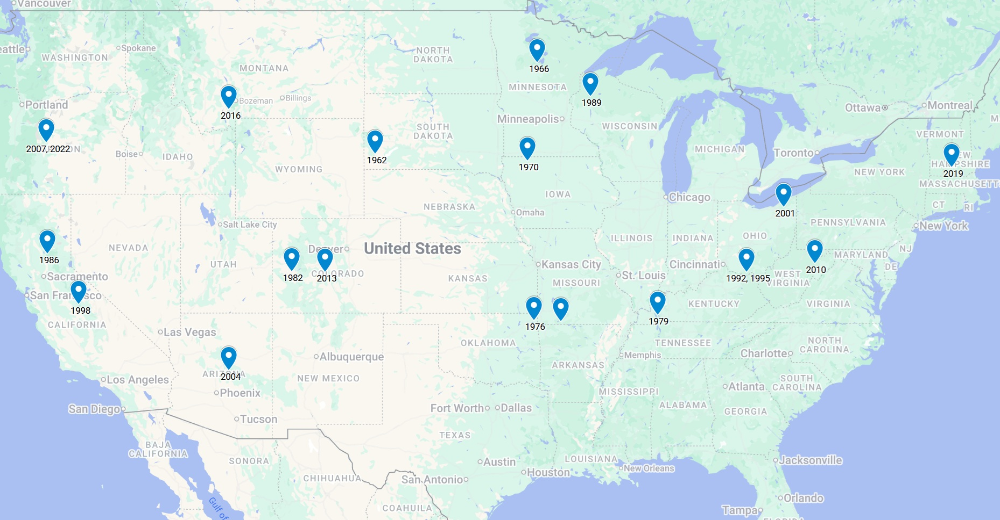

### Longitude vs. Latitude Scatter

A simpler coordinate scatter view of the same locations. The westward drift of recent reunions is clearly visible, with the 2025 Waikiki gathering standing out far to the southwest.

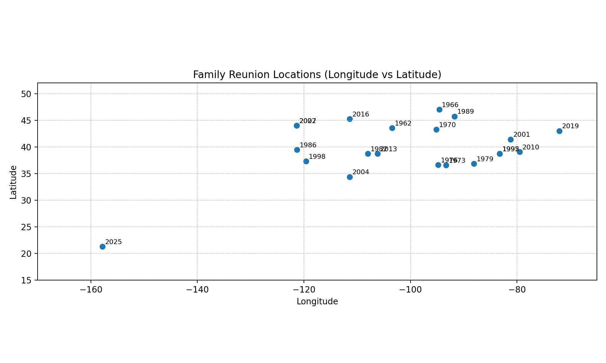

---

## Regional & State Breakdown

### Reunions by Region

The West leads with 9 reunions, followed by the Midwest with 8. The South hosted 3 gatherings, while the Northeast and Hawaii each account for 1. The family has clearly favored western mountain and lake destinations in recent decades.

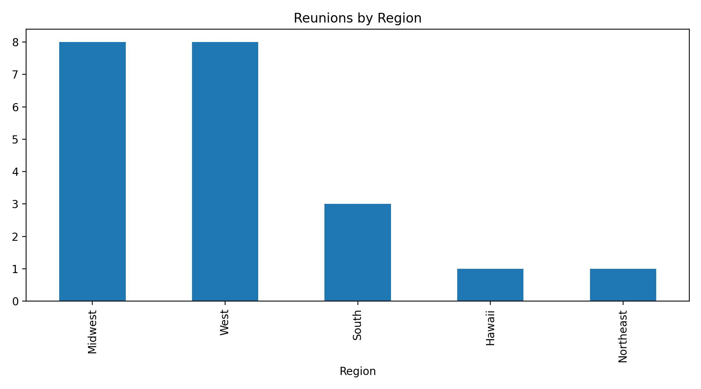

### Reunions by State

Ohio (OH) and Oregon (OR) are tied for the most-visited states with 3 reunions each — Shawnee State Park twice and Punderson State Park once in Ohio, and Mt. Bachelor Village twice in Oregon. Colorado and California each hosted 2 reunions.

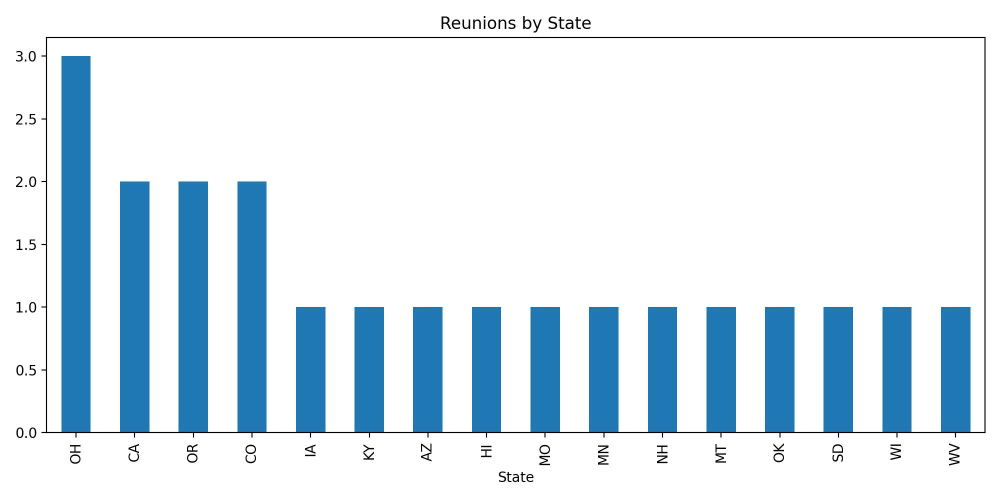

---

## Venue Types

Resorts dominate the reunion history with 10 appearances (including Ranch Resort, Village Resort, and Beach Resort variants). State Parks account for 4 reunions. The family has also stayed at a lodge, cottages, and a hotel. The preference for resort-style accommodations reflects the need for group lodging and on-site activities.

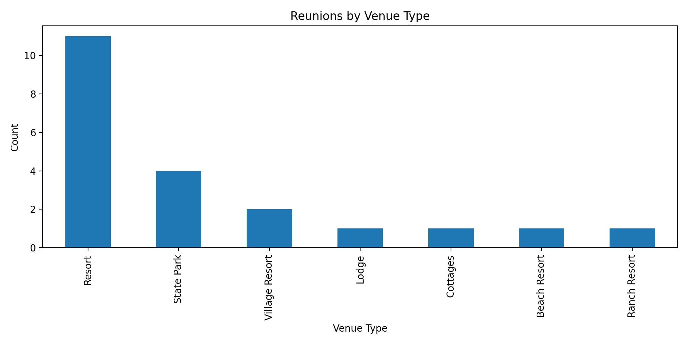

---

## Reunion Timeline

Every reunion year plotted chronologically. The family initially met on a roughly 4-year cycle (1962, 1966, 1970, 1973…), which settled into a consistent 3-year cadence from 1976 onward. That pattern has held steady for nearly 50 years.

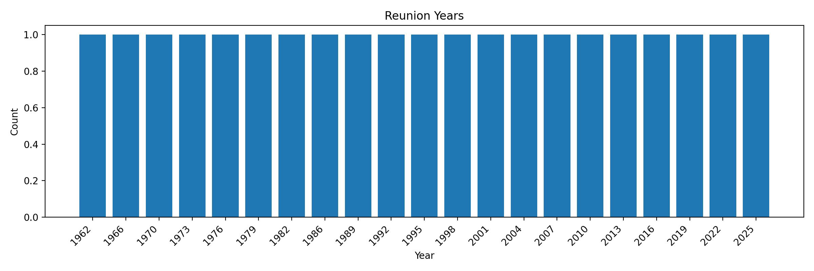

---

## Climate at Reunion Sites

### Average July High Temperatures

July high temperatures at reunion sites have ranged from a mild 72.5 °F at Mt. Princeton Resort, CO (2013, elevation ~8,000 ft) to a scorching 98.1 °F at The Pines, Bass Lake, CA (1998). Most sites cluster in the low-to-mid 80s. The hottest venue, Harmel's Ranch Resort in CO (1982), hit 96.1 °F — surprisingly warm for a Colorado location.

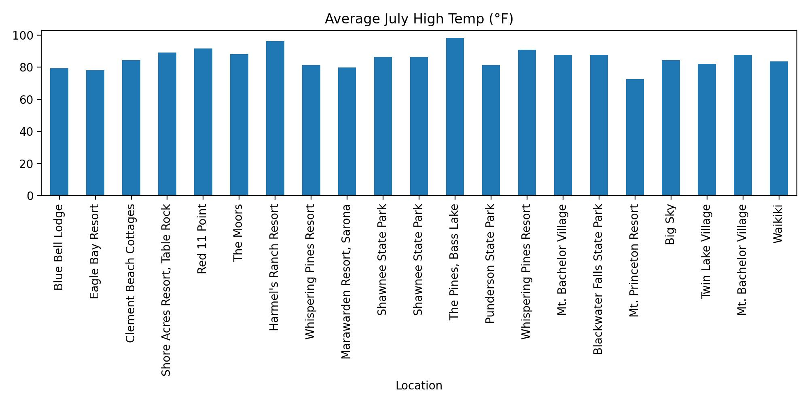

### Temperature vs. Humidity Scatter

This scatter plot reveals distinct climate clusters among reunion sites. Western locations (CO, OR, MT, AZ) group in the low-humidity corner regardless of temperature. Midwestern and Southern sites trend toward moderate-to-high humidity. The most uncomfortable combination was The Moors, KY (1979) at 88 °F and nearly 80% humidity, while the driest/hottest was Harmel's Ranch Resort, CO (1982) at 96 °F and just 24% humidity.

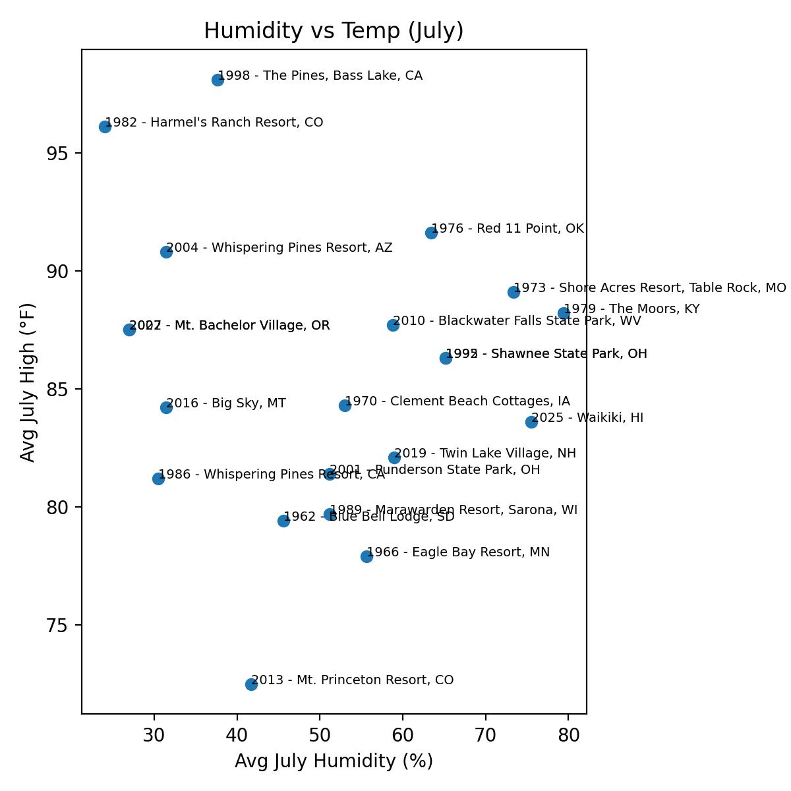

### High Temps vs. Humidity (Alternate View)

An alternate scatter visualization of July high temperatures plotted against humidity, highlighting the same climate trade-offs across venues.

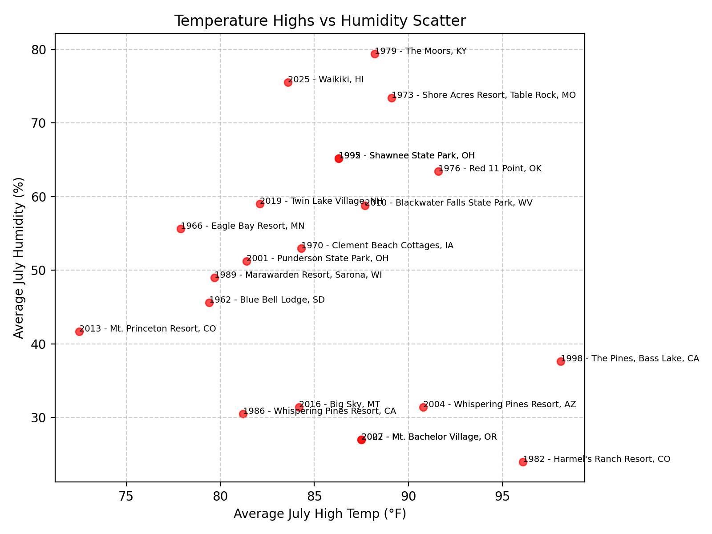

---

## Airport Accessibility

### Distance to Nearest Major Airport

Most reunion sites sit 150–500 km from the nearest major airport, with a noticeable cluster in the 200–300 km range. The closest was Whispering Pines Resort, AZ (2004), just 121 km from Phoenix Sky Harbor. The 2025 Waikiki reunion is a dramatic outlier at 3,855 km from the nearest major airport in the dataset (though Honolulu's Daniel K. Inouye Intl is actually on-island).

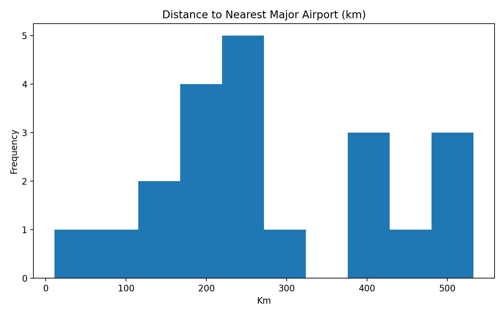

### Distance to Nearest Regional Airport

Regional airstrips have always been close by — the median distance is under 10 km. Harmel's Ranch Resort, CO (1982) was nearest to a regional field at just 2 km (Sky Island Ranch Airport). The farthest was Shawnee State Park, OH (1992 & 1995) at 21.5 km from Hidden Quarry Airport.

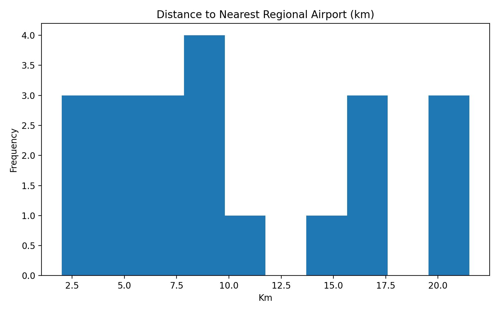

### Airport Distances by Site (Miles)

A side-by-side comparison of major vs. regional airport distances for every reunion site, converted to miles. Regional airports are almost universally within 15 miles, while major airport distances vary widely — from ~75 miles (AZ 2004, NH 2019) to over 330 miles (MO 1973, MT 2016).

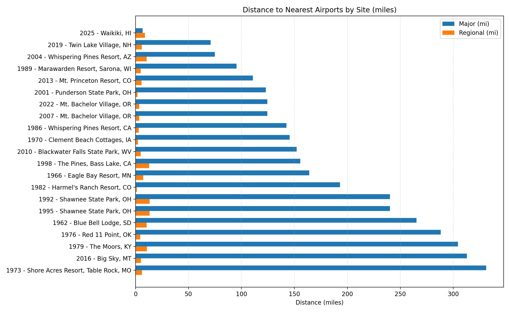

---

## Key Takeaways

- **63 years of tradition**: 21 reunions from 1962 to 2025, averaging one every 3 years since 1976.
- **Westward trend**: The West has hosted 9 of 21 reunions, including 4 of the last 6.
- **Resort culture**: The family overwhelmingly prefers resort-style venues that can accommodate large groups.
- **Climate sweet spot**: Most sites land in the 80–90 °F range with moderate humidity — warm but not extreme.
- **Repeat favorites**: Ohio (3 visits) and Oregon (2 visits to the same Mt. Bachelor Village) show that the family returns to places it loves.
- **2025 — the outlier**: Waikiki is the first reunion outside the contiguous U.S. and brings the warmest lows (74 °F), highest humidity (76%), and by far the greatest travel distance.
